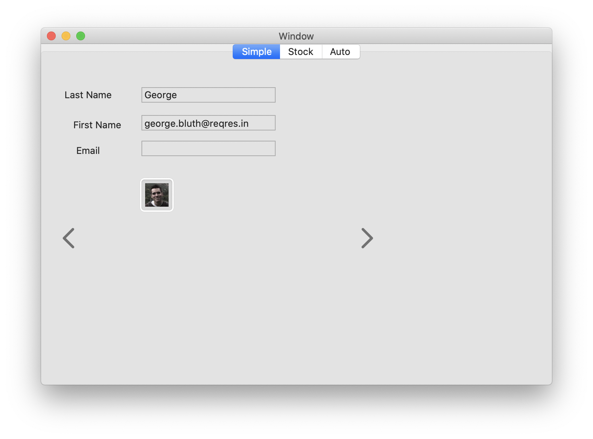
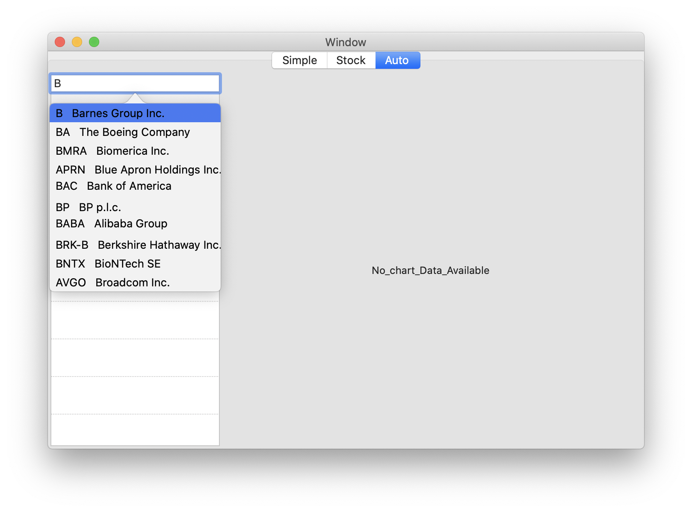

# just understand closure

# closure

Read more about escaping closure on Apple documentation here.
https://docs.swift.org/swift-book/LanguageGuide/Closures.html#//apple_ref/doc/uid/TP40014097-CH11-ID546

<p align="center">
    
    <p align="center">
        <em>simple</em>
    </p>
</p>

<p align="center">
    
    <p align="center">
        <em>simple</em>
    </p>
</p>

<p align="center">
    
    <p align="center">
        <em>simple</em>
    </p>
</p>


# Under construction

```Swift
func loadData(id : Int) {
    
    fetchUser(userID: id, userCompletionHandler: { user, error in
        
        if let user = user {
            DispatchQueue.main.async(execute: {() -> Void in
                
                self.nameLabel.stringValue = user.last_name ?? "empty"
                self.firstName.stringValue = user.first_name ?? "empty"
                self.emailLabel.stringValue = user.email ?? "empty"
                let url = URL(string:  user.avatar!)
                let image = NSImage(contentsOf: url!)
                self.image.image = image
            })
        }
    })
}

func fetchUser(userID: Int, userCompletionHandler: @escaping (User?, Error?) -> Void) {
    let url = URL(string: "https://reqres.in/api/users/\(userID)")!
    let task = URLSession.shared.dataTask(with: url, completionHandler: { data, response, error in
        
        guard let data = data else { return }
        do {
            // parse json data and return it
            let decoder = JSONDecoder()
            let jsonDict = try decoder.decode([String: User].self, from: data)
            if let userData = jsonDict["data"] {
                userCompletionHandler(userData, nil)
            }
            
        } catch let parseErr {
            print("JSON Parsing Error", parseErr)
            userCompletionHandler(nil, parseErr)
        }
    })
    
    task.resume()
    // function will end here and return
    // then after receiving HTTP response, the completionHandler will be called
}

```
